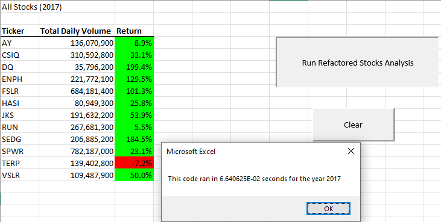
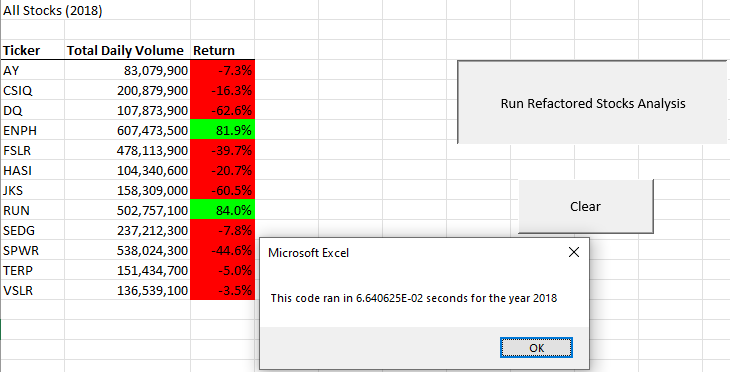

# VBA_Challenge

## Overview of Project

  The purpose of this analysis is to improve the speed of the VBA analysis of multiple stocks for the years 2017 and 2018. As you work with larger and larger data sets that require analysis, speed becomes critical, especially when it comes to making important decisions. As we look at later on, the results and the possible drawbacks.

## Results

  In 2017 and 2018, we were able to drastically improve the speed of code to the point that the times had to be expressed in the of (E) or exponent of 10. When you compare both 2017 and 2018, 2017 was a better year for 11 of the 12 stocks analyzed.

## Summary

  The main advantage of refactoring code is that optimized for performance so that is can work more efficiently. This is done by simplifying the code to be more streamlined. But with every improvement, there are drawbacks. It takes times to go through your code and see where improvements can be made without altering the overall function of the code. This attempt of refactoring may cause you to make mistakes which you will need to spend time correcting in the future.

  As you can see from the results, the pros of refactoring really helped me improve my code to be faster and more efficient. Since the code was not complicated to begin with, I was able to refactor it with some ease. But had it been anymore complicated then there would have been more room for error and make it time consuming.
